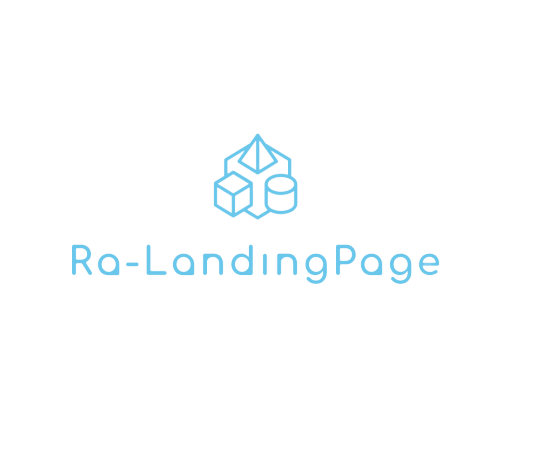

# Ra-Landingpage
基于Vue.js、GrapeJs 开发的 Landingpage 配置网站

<!-- PROJECT SHIELDS -->
<!-- 
[![Contributors][contributors-shield]][contributors-url]
[![Forks][forks-shield]][forks-url]
[![Stargazers][stars-shield]][stars-url]
[![Issues][issues-shield]][issues-url]
[![MIT License][license-shield]][license-url]
[![LinkedIn][linkedin-shield]][linkedin-url] -->

<!-- PROJECT LOGO -->
<br />

<p align="center">
  <a href="https://github.com/ra-utility/ra-langdingpage">
    
  </a>

  <h3 align="center">"完美的" Landingpage 解决方案</h3>
  <p align="center">
    快速创建一个Landingpage，而不需要从0构建一个项目
    <br />
    <!-- <a href="https://github.com/shaojintian/Best_README_template"><strong>探索本项目的文档 »</strong></a> -->
    <br />
    <br />
    <!-- <a href="https://github.com/shaojintian/Best_README_template">查看Demo</a>
    ·
    <a href="https://github.com/shaojintian/Best_README_template/issues">报告Bug</a>
    ·
    <a href="https://github.com/shaojintian/Best_README_template/issues">提出新特性</a> -->
  </p>

</p>


## 目录

- [demo](#demo)
- [上手指南](#上手指南)
  - [环境要求](#环境要求)
  - [安装步骤](#安装步骤)
- [文件目录说明](#文件目录说明)
- [开发的架构](#开发的架构)
- [部署](#部署)
- [使用到的框架](#使用到的框架)
- [鸣谢](#鸣谢)
- [TODO](#TODO)

### demo


* [demo](https://ra-langdingpage.logiczc.now.sh/)

### 上手指南

#### 环境要求
- node: v>=10.0
- vue: >= 2.5.x


#### 安装步骤
```sh
# fork or clone the repository
git clone xxxxx

# install
cd xxx
yarn 

# run
yarn start

```


### 部署

使用 `zeit now` 部署 WEB 端应用([zeit now](https://zeit.co/)).

### 使用到的框架

- [grapeJs](https://github.com/artf/grapesjs)
- [vueJs](https://www.google.com/search?q=vue.js&oq=vue.js&aqs=chrome..69i57j0l2j69i65l2j69i61l3.4501j0j4&sourceid=chrome&ie=UTF-8)
- [electronJs](https://www.electronjs.org/)


### 鸣谢

- [initialize.scss](https://github.com/jeroenoomsNL/initialize-css/blob/master/src/styles/initialize.scss)
- [animeJs](https://animejs.com/documentation/#round)
- [Animate.css](https://daneden.github.io/animate.css/)
- [Now](https://zeit.co/)

### TODO
- [ ] 支持暗黑主题
- [ ] 支持 VUE 组件导出
- [ ] 增加块组件
- [ ] 支持代码可编辑
- [ ] LandingPage 动画嵌入
